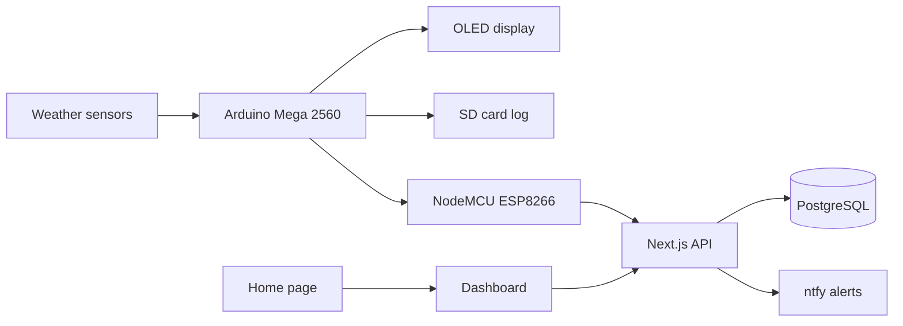
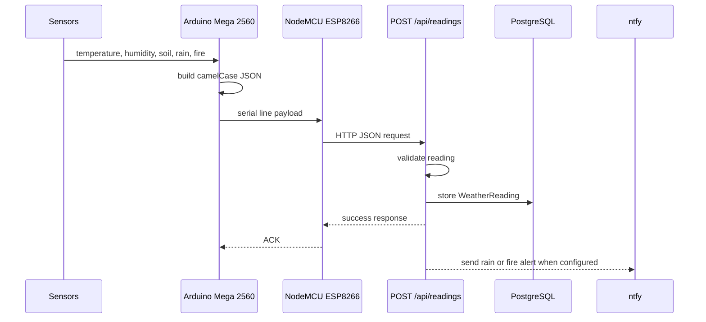
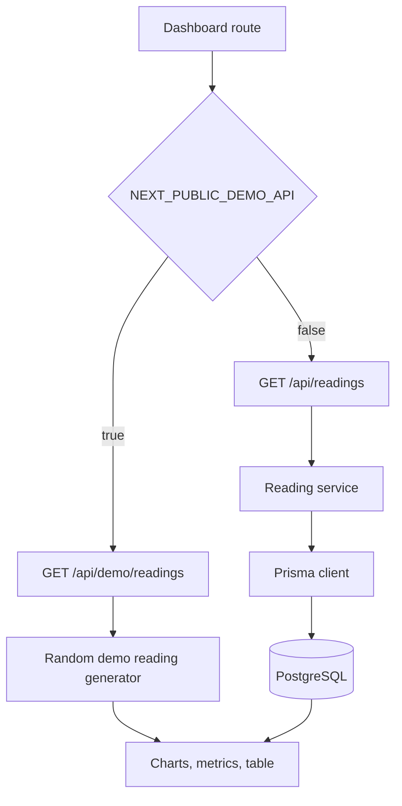
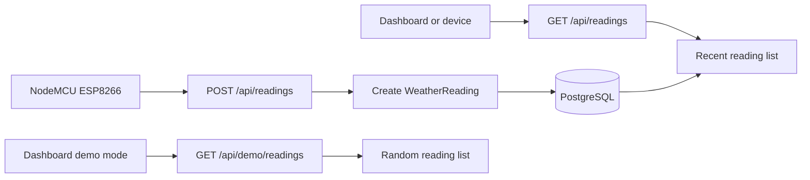
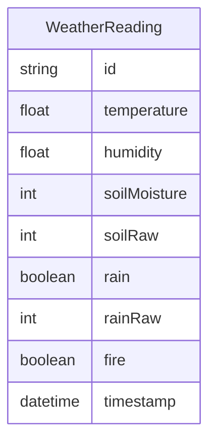
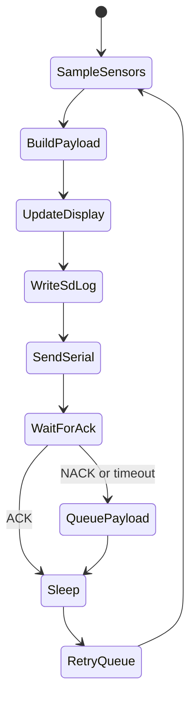

# The Weather Man Diagrams

## System Overview

```mermaid
flowchart LR
  Sensors[Weather sensors] --> Mega[Arduino Mega 2560]
  Mega --> Display[OLED display]
  Mega --> Storage[SD card log]
  Mega --> NodeMcu[NodeMCU ESP8266]
  NodeMcu --> Api[Next.js API]
  Api --> Database[(PostgreSQL)]
  Api --> Alerts[ntfy alerts]
  Dashboard[Dashboard] --> Api
  Home[Home page] --> Dashboard
```

## Reading Flow

```mermaid
sequenceDiagram
  participant Sensors as Sensors
  participant Mega as Arduino Mega 2560
  participant NodeMcu as NodeMCU ESP8266
  participant Api as POST /api/readings
  participant Db as PostgreSQL
  participant Alert as ntfy

  Sensors->>Mega: temperature, humidity, soil, rain, fire
  Mega->>Mega: build camelCase JSON
  Mega->>NodeMcu: serial line payload
  NodeMcu->>Api: HTTP JSON request
  Api->>Api: validate reading
  Api->>Db: store WeatherReading
  Api-->>NodeMcu: success response
  NodeMcu-->>Mega: ACK
  Api-->>Alert: send rain or fire alert when configured
```

## Web App Runtime

```mermaid
flowchart TB
  Env{NEXT_PUBLIC_DEMO_API}
  Env -->|true| DemoApi[GET /api/demo/readings]
  Env -->|false| ReadApi[GET /api/readings]
  Dashboard[Dashboard route] --> Env
  DemoApi --> Generator[Random demo reading generator]
  ReadApi --> Service[Reading service]
  Service --> Prisma[Prisma client]
  Prisma --> Database[(PostgreSQL)]
  Generator --> Charts[Charts, metrics, table]
  Database --> Charts
```

## API Surface

```mermaid
flowchart LR
  Client[Dashboard or device] --> GetReadings[GET /api/readings]
  Device[NodeMCU ESP8266] --> PostReadings[POST /api/readings]
  Dashboard[Dashboard demo mode] --> DemoReadings[GET /api/demo/readings]

  GetReadings --> Recent[Recent reading list]
  PostReadings --> Create[Create WeatherReading]
  DemoReadings --> Random[Random reading list]

  Create --> Database[(PostgreSQL)]
  Database --> Recent
```

## Database Model

```mermaid
erDiagram
  WeatherReading {
    string id
    float temperature
    float humidity
    int soilMoisture
    int soilRaw
    boolean rain
    int rainRaw
    boolean fire
    datetime timestamp
  }
```

## Firmware Loop

```mermaid
stateDiagram-v2
  [*] --> SampleSensors
  SampleSensors --> BuildPayload
  BuildPayload --> UpdateDisplay
  UpdateDisplay --> WriteSdLog
  WriteSdLog --> SendSerial
  SendSerial --> WaitForAck
  WaitForAck --> Sleep: ACK
  WaitForAck --> QueuePayload: NACK or timeout
  QueuePayload --> Sleep
  Sleep --> RetryQueue
  RetryQueue --> SampleSensors
```
